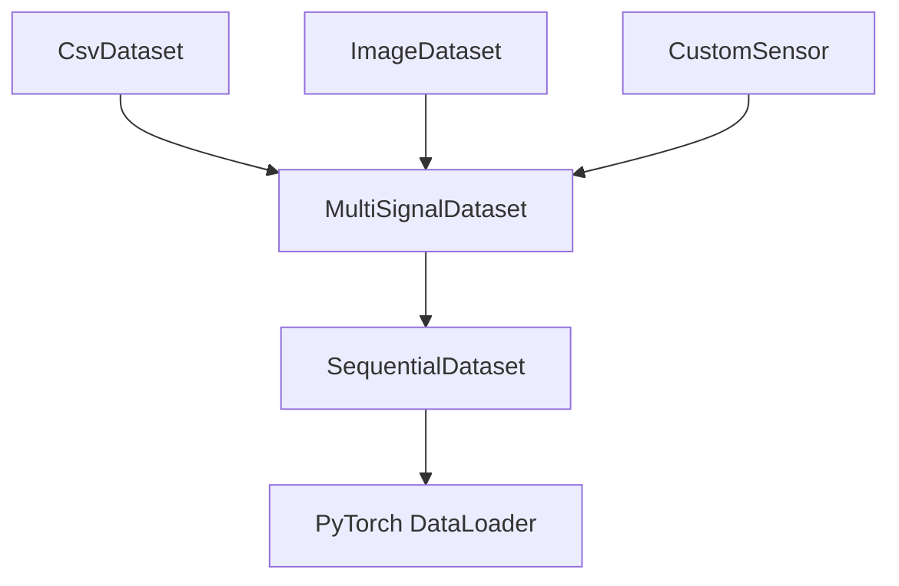

# Synaesthesia 🧠🎨

**Composable PyTorch Data Pipelines for Multi-Modal Sensor Fusion.**

## Overview 🌟

Synaesthesia is a modular Python library designed to be the foundation of your data stack. It allows you to build complex, multi-modal PyTorch/PyTorch Lightning datasets by composing simple primitives. Whether you are dealing with synchronized CSV logs, high-speed video, or multi-spectral imagery, Synaesthesia handles the alignment, sequencing, and batching.

## Key Features 🔑

- **Modular Composition** 🧩: Mix and match datasets like LEGO bricks.
- **Multi-modal Alignment** 📡: Automatically synchronize different sensors via timestamps.
- **Flexible Strategies**:
  - **Parallel**: `MultiSignalDataset` for sensor fusion.
  - **Serial**: `CustomConcatDataset` for combining multiple runs/sessions.
  - **Temporal**: `SequentialDataset` for time-series and RNN/Transformer inputs.
- **Lightning Ready** ⚡: Built-in `ParsedDataModule` for seamless PyTorch Lightning integration.

## Installation 💻

```bash
# Using uv (recommended)
uv add synaesthesia

# Using pip
pip install synaesthesia
```

*Note: Requires Python 3.10+, PyTorch, and PyTorch Lightning.*

## Quick Start 🚀

```python
from synaesthesia.base_sensors import CsvDataset, ImageDataset
from synaesthesia.abstract import MultiSignalDataset, SequentialDataset

# 1. Define your raw sensors
csv_ds = CsvDataset(path="telemetry.csv", cols=["speed", "accel"])
img_ds = ImageDataset(folder_path="camera_frames/", extension="jpg")

# 2. Synchronize them (aligns timestamps automatically)
multi_ds = MultiSignalDataset([csv_ds, img_ds], aggregation="common", fill="closest")

# 3. Create sequences (e.g., 5-frame windows for a GRU)
seq_ds = SequentialDataset(multi_ds, n_samples=5, stride=1)

# 4. Access data
sample = seq_ds[0] 
# Returns: {'csv_id': ..., 'image_id': ..., 'timestamps': [...]}
```

## Architecture 🏗️



## Contributing 🤝

If you want to build new sensor types or extend the core logic, please refer to the [Developer Guide (CONTRIBUTING.md)](./CONTRIBUTING.md).

## License 📄

Licensed under APACHE-2.0.
